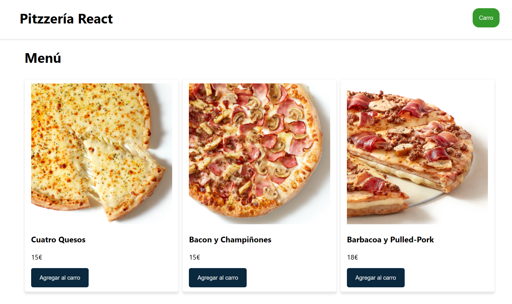
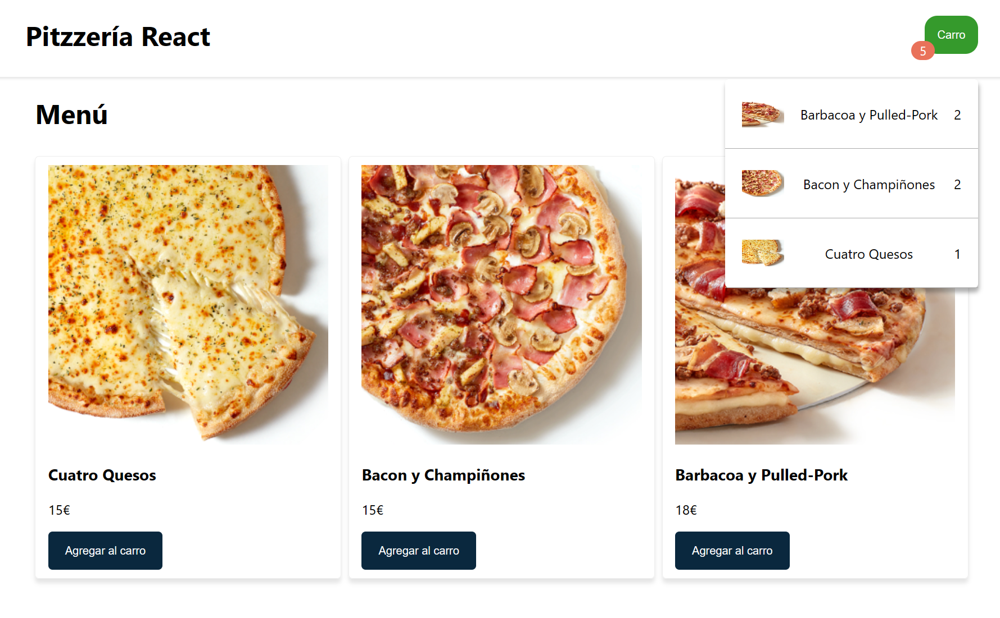

<h1 align="center" style="color: #0366d6;">
   Simulador de Carrito de Compra de Pizzería Online
</h1>

- **Prueba del Proyecto:** Para experimentar con todas las funcionalidades del proyecto, sigue estos pasos:

  1. Realiza una copia local del repositorio o descárgalo.
  2. Abre una terminal y navega hasta el directorio del proyecto.
  3. Ejecuta el siguiente comando para instalar las dependencias:

     ```bash
     npm install
     ```

     Este comando descargará e instalará las bibliotecas y herramientas necesarias para ejecutar el proyecto.

  4. Una vez completada la instalación, inicia la aplicación con el siguiente comando:

     ```bash
     npm start
     ```

     Esto iniciará el servidor local y abrirá la aplicación en tu navegador predeterminado.

  5. Explora el simulador de carrito de compra de pizzería, selecciona pizzas, ajusta cantidades y disfruta de la experiencia de compra.

  Ten en cuenta que estos comandos deben ejecutarse en un entorno Node.js y se asume que ya tienes Node.js y npm instalados en tu sistema.

- **Selección de Pizzas:** Los usuarios pueden seleccionar diferentes pizzas y agregarlas al carrito de compra.

---

<div align="center">
  
</div>

---

- **Carrito de Compra:**

---

<div align="center">
  
</div>

---

## Tecnologías Utilizadas ⚙️

<div align="left">
  
  
  
  
  
  
</div>

---

## Contacto

- **Mi web**
  https://code-cube.netlify.app/

- **Linkedin**
  https://www.linkedin.com/in/bruno-orgilles-309505262
